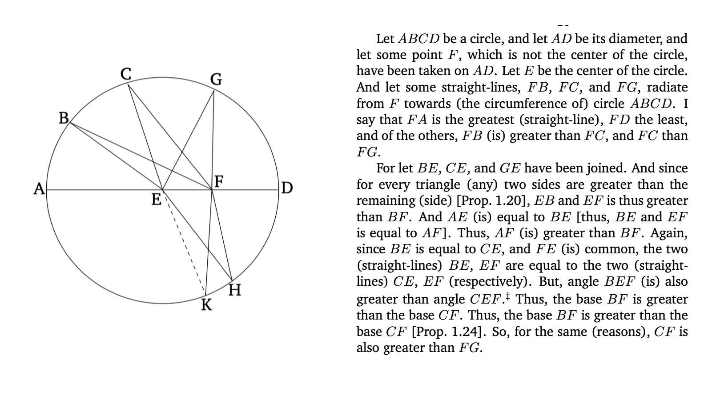
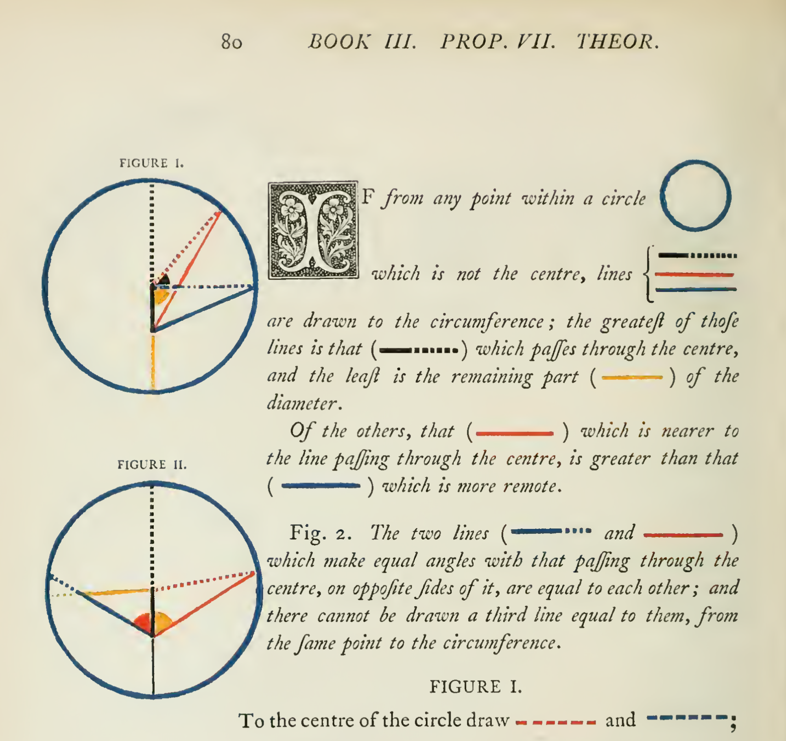
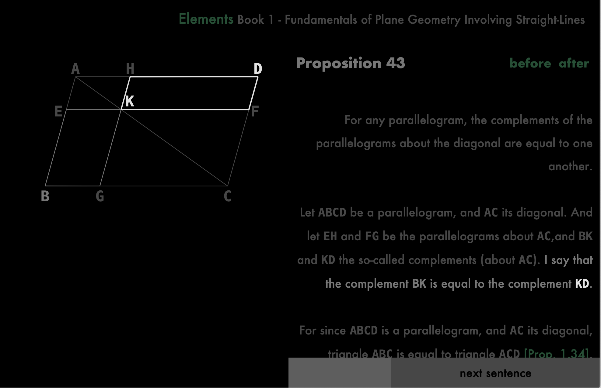

An experiment in presenting geometry.

### How?

This is a clip from a geometry book. Particularly a translation of the 2300 year old Elements. Reading it requires going back and forth between the figure and the prose multiple times in most of the sentences. Which gets rather tedious and borderline torturous when you need to read again. Coloring it would help greatly.

This is from Oliver Byrne’s work(a digital version can be found at [c82.net/euclid](https://c82.net/euclid)). About 180 years ago he made use of colored print and made a phenomenal contribution. That brings a question: Now that we have digital displays that gets refreshed 60 times every second, what more can be done?

The usual answer is to record a video. Which dictates a rhytym, isolates fragments, strains potential participation and mostly turns ridiculous under production costs. Surely films are awesome but their teaching of technical material is not the strong aspect.

Now follow this: [canberead.com/elements/1.43](https://canberead.com/elements/1.43). And press j/k or right/left on keyboard or use the gray buttons at the bottom of the page. That should move a cursor along the prose and highlight the figure for symbols. You can also click on sentences.

The human eye can't distinguish between more than a handful of colors and picking colors for all the lines is somewhat difficult. But with differential brightness for resonate highlights the complexity of the figure is not an issue as long as it is a reasonable figure. Color can be reserved for further development like the presentation of symbolic expressions.

Also, i tried to keep the figure visible in a separate column as the prose gets scrolled, which seems like a more fundamental issue for digital books. But it is impossible to argue for when the software is taken to be generic money making machine of vanishing marginal costs or simulation of absolute laws. Proper utilization of screen space will have to wait for a new generation.

### Why?

> As for ancient geometrical analysis and modern algebra, even apart from the fact that they deal only in highly abstract matters that seem to have no practical application, the former is so closely tied to the consideration of figures that it is unable to exercise the intellect without greatly tiring the imagination, while in the latter case one is so much a slave to certain rules and symbols that it has been turned into a confused and obscure art that bewilders the mind instead of being a form of knowledge that cultivates it.
>
> &mdash; *R. Descartes, A Discourse on the Method, 1637*

This is mathematics at the beginning of modernity summarized by the inventor of Analytic Geometry; Introduced as 'my method' later in the same book.

Screens are part of the computers for about fifty years now. But couple thousand years of imaginative work on paper determined that screens be an imitation of paper, for the most part. Basic container of data was inherited as files and folders. Much of the private computer was put together in a company that makes photocopy machines. Within which the preview of a print had monumental benefit along with a pointer device and a virtual catalog. Word processors, spreadsheets and slides came to be the most used software and suggested a future as typical products. And we come to look at web pages that were conceived to be accessible versions of physical documents.

Imitation is mostly effective but it can also be frustrating. But frustrations are a bit difficult to demonstrate. First, It is not obvious how information technology should leave the office and become relevant to life besides facilitation of bureaucracies or consumption of packaged entertainment. Second, criticism of digitized paperwork(i.e. finance) seem to fall on deaf ears. And i will not try to point out that relevance at a time anarchy and chaos are synonymous. Nor will i be an impotent reactionary and define a principal in negation to concentration of power. Instead, the new medium is taken as ground to experiment around prevailing institutional dependence and brute specialization that beats their imagination out of people.

Of course, this alone can't leave a dent in the curricular consumption called education but one question had to be made explicit: What can be done better than on paper? So that we come to be aware of the cultural momentum and possibly see a course correction.
